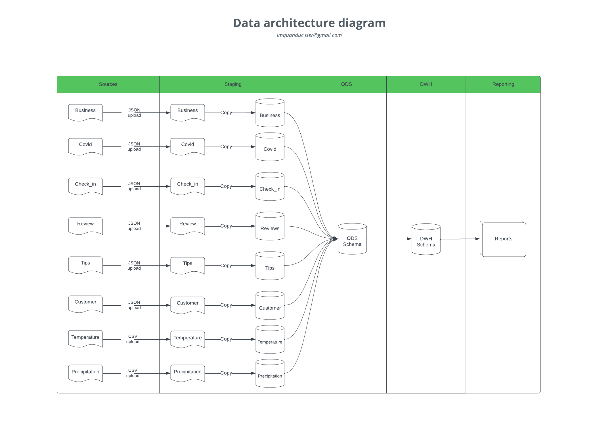
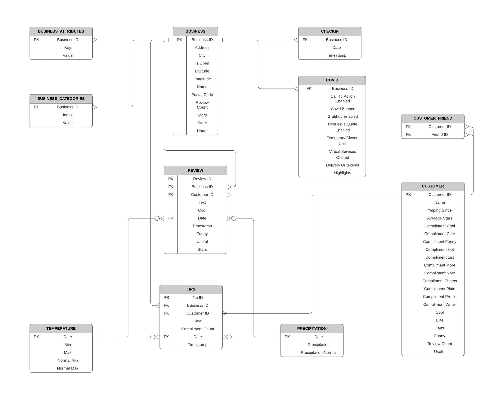
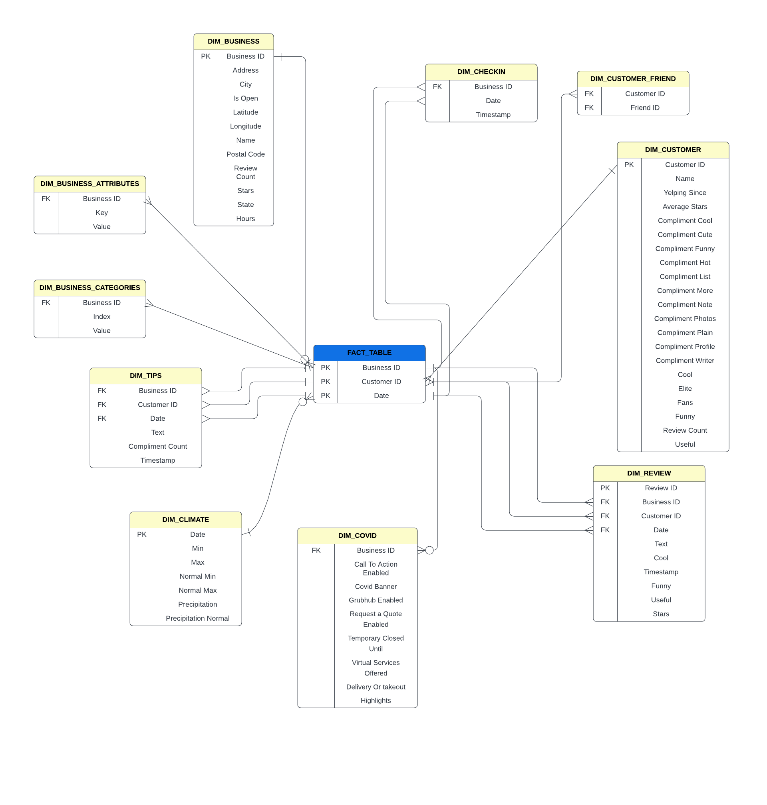

# Project Data System Design - Design a Data Warehouse for Reporting and OLAP

In this project scenario, we will use actual YELP and climate datasets in order to analyze the effects the weather has on customer reviews of restaurants. The data for temperature and precipitation observations are from the Global Historical Climatology Network-Daily (GHCN-D) database. I also use a leading industry cloud-native data warehouse system called Snowflake for all aspects of the project.

## DATA SOURCES

1. YELP DATA
- The Yelp dataset is a subset of our businesses, reviews, and user data for use in personal, educational, and academic purposes. Available as JSON files, use it to teach students about databases, to learn NLP, or for sample production data while you learn how to make mobile apps.
- We will use 4 sources from [YELP website](https://www.yelp.com/dataset/download) and 1 source about Covid-19 stats from [Kaggel page](https://www.kaggle.com/datasets/claudiadodge/yelp-academic-data-set-covid-features?select=yelp_academic_dataset_covid_features.json)
    - yelp_academic_dataset_business.json
    - yelp_academic_dataset_checkin.json
    - yelp_academic_dataset_covid_features.json (from Kaggel)
    - yelp_academic_dataset_review.json
    - yelp_academic_dataset_tip.json
    - yelp_academic_dataset_user.json

2. CLIMATE DATA

- We also need climate data, which is provided as two CSV files in the Resources tab in the classroom.
    - Precipitation Data - USW00023169-LAS VEGAS MCCARRAN INTL AP-PRECIPITATION-INCH
    - Temperature Data - USW00023169-TEMPERATURE-DEGREEF. 
- The above data files contain historical weather data for the city of Las Vegas (Nevada) (Weather Station - USW00023169), and were obtained from [Climate Explorer](https://crt-climate-explorer.nemac.org/).

## INSTRUCTION

- Create a data architecture diagram to visualize how we will ingest and migrate the data into Staging, Operational Data Store (ODS), and Data Warehouse environments, so as to ultimately query the data for relationships between weather and Yelp reviews.
- Create a staging environment(schema) in Snowflake. Upload all Yelp and Climate data to the staging environment.
    **NOTE**: <em>We may need to SPLIT these datasets into several smaller files (< 3 million records per file in YELP)</em>.
- Create an ODS environment(aka schema).
- Draw an entity-relationship (ER) diagram to visualize the data structure.
- Migrate the data into the ODS environment.
- Draw a STAR/SNOWFLAKE schema for the Data Warehouse environment.
- Migrate the data to the Data Warehouse.
- Query the Data Warehouse to determine how weather affects Yelp reviews.

## RESULT

### Data Architecture 

### ER Model

### Dimentional Schema
